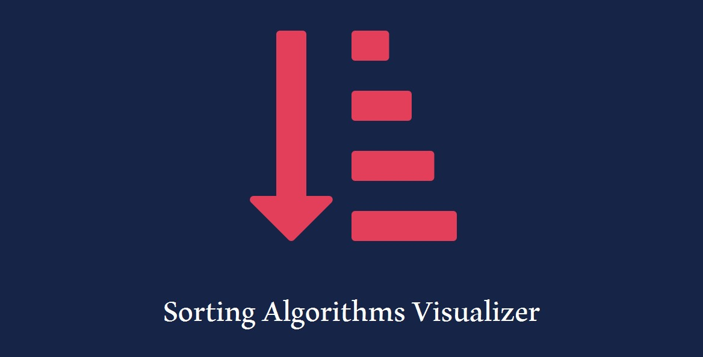
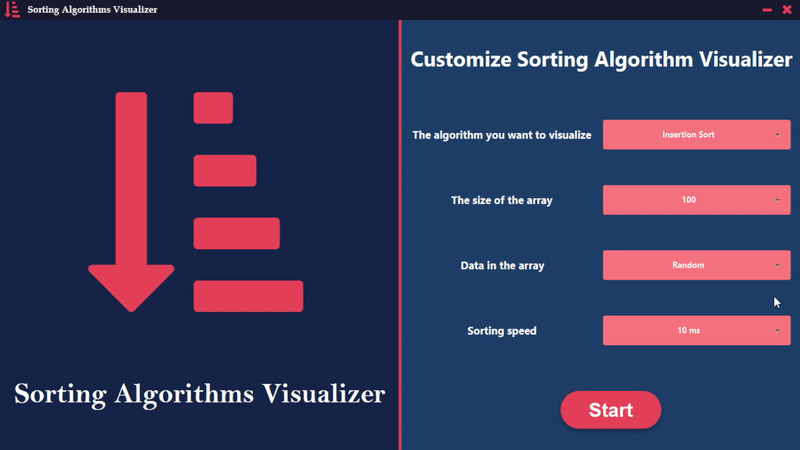

# Sorting Algorithms Visualizer

---

  

    
    
    
    
  
	

An application that visualizes many sorting algorithms.

---

## Contents:

1. [Features](#features)
2. [Installation](#installation)
3. [Frameworks and Libraries](#frameworksandlibraries)

---

## 🎯 Features:

- You can select the algorithm you want to visualize. There are many of sorting algorithms in the application:
    - Insertion Sort
    - Selection Sort
    - Bubble Sort

- You can change the size of the array that you want to sort.

- There is also an option for you to change the order of the elements within the array, whether you want them random,
  ascending or descending.

- Moreover, you can change the speed of the visualization.

- You can control the visualization, for instance, running the algorithm step by step or continuously and the ability to
  stop the visualization at a specific position or even restart the visualization without having to return to the home
  page.

---

## ⚙️Installation:

- You should have JDK-11 or higher. If you do not have it, you can download it
  from [here](https://www.oracle.com/se/java/technologies/javase-jdk11-downloads.html).
- Download the Sorting Algorithms Visualizer jar file from Releases tab or simply by clicking [here](https://github.com/OudayAhmed/Sorting-Algorithms-Visualizer/releases/download/v1.0/Sorting.Algorithms.Visualizer.jar)
  .

---

## 💡 Frameworks and Libraries:

- JavaFX
- Ikonli
- JFoenix

---
